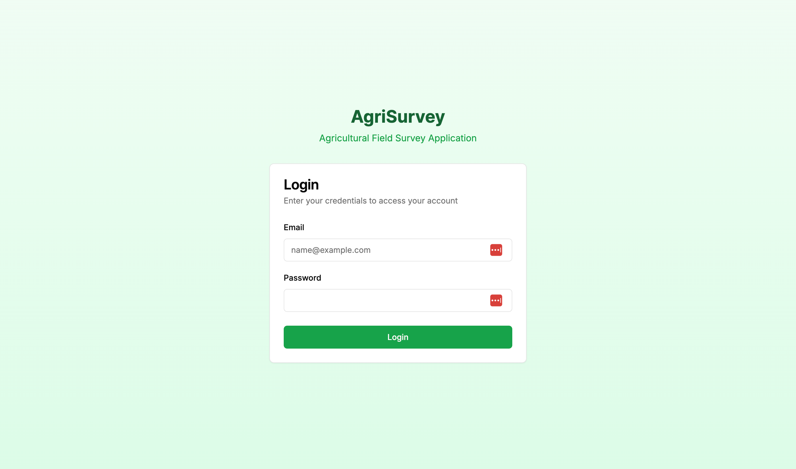
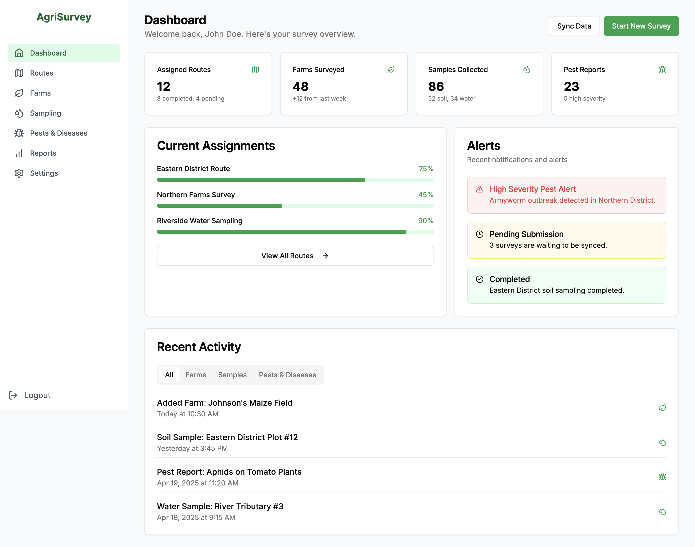
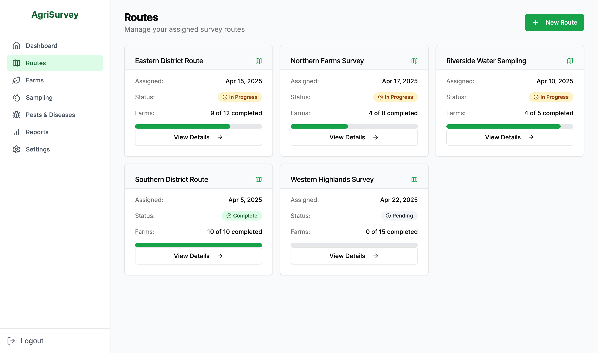
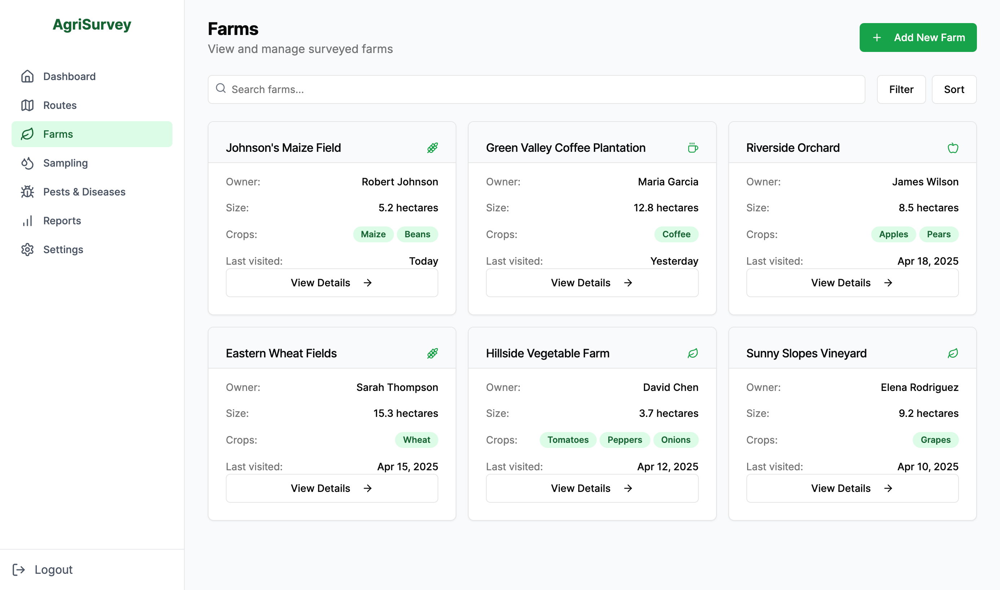
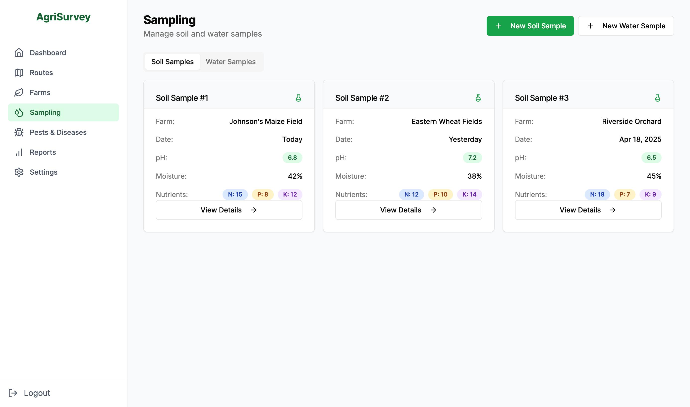
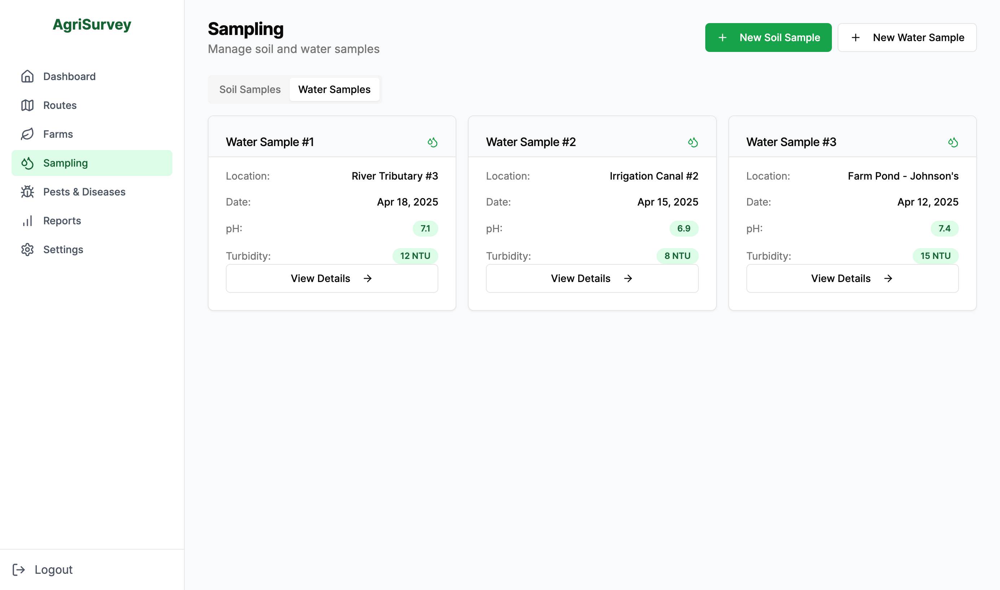
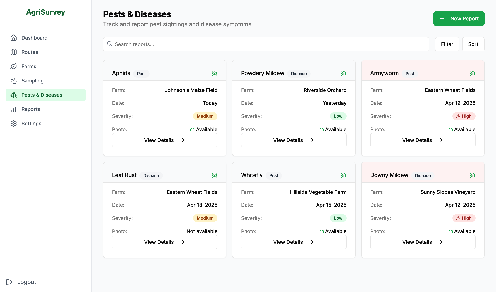

# WOC7014 Group Project Report

*Project Title* : AgriSurvey  
*Framework* : Django, Next.js  
*Group Members* : Du Wentao (Matric Number), Wu Yilin (Matric Number), Li Fenyong (Matric Number), Hou Yujie (Matric Number), Bopitiyage Sithum Sandeepa Perera (24081446)  
*Project Description* : Lightweight web app for agricultural data collection which enables field enumerators to record farm details, crop info, samples, and pest reports.  

## Modules and Functions:

### 1. Auth and Dashboard

*Group Members* : Du Wentao (Matric Number)

**Authentication**

The Auth module handles user authentication, and the Dashboard module provides a comprehensive overview of agricultural survey data and an efficient operation portal.

The login interface is simple and intuitive, and users only need to enter their account number and password to quickly access the system.

**Dashboard**

AgriSurvey's dashboard is the user's core work platform. 

It displays assigned routes, surveyed farms, sample numbers, and pest and disease reports through intuitive cards and progress bars. 

The "Current Assignments" area uses a progress bar to clearly show the completion of tasks, while the "Alerts" section pushes emergency notifications in real time. 

The "Recent Activity" at the bottom dynamically records the latest operations.

### 2. Routes and Farms

*Group Members* : Li Fenyong (Matric Number)

**Routes**

The Route module clearly displays the key information of each route in the form of cards, including route name, status, completion progress, and assigned date. Users can view route details through "View Details" or create a new task through "Add New Route," fill in the name, status, and number of associated farms, and save.

**Farms**

The Farm module allows you to browse all surveyed farms through a list. Each farm card displays key data such as the owner, area, crops planted, and last visit date, and supports "View Details" to view details. The module provides powerful search and filtering functions and also supports quick registration of new farms through "Add New Farm," filling in the name, owner, area, and associated routes, and saving.

### 3. Sampling

*Group Members* : Li Fenyong (Matric Number)

**Soil Sample**

The Soil Sample module can easily record detailed information about each soil sample, including the farm it belongs to, the date it was collected, pH value, moisture, and key nutrient content. The module supports adding new samples through a form, filling in farm, pH value, moisture, and nutrient data, and uploading sample photos and adding notes.

**Water Sampling**

The Water Sample module can record core indicators such as sample source, test date, pH value, turbidity, etc., and supports uploading sample photos and adding observation notes. The module supports quick screening and detailed viewing. Through the "Add New Water Sample" function, users can efficiently complete the entry of water sampling data.

### 4. Pests & Diseases

*Group Members* : Hou Yujie (Matric Number)

The Pest & Disease module allows users to quickly report pest and disease incidents through a standardized form, including selecting key information such as the associated farm, category, name, and severity, and can upload on-site photos and detailed descriptions of symptoms. The system automatically generates timestamp records and displays historical reports in the form of visual cards, supporting filtering and sorting by farm, date, and severity. The full report can be viewed through "View Details."

### 5. Reports

*Group Members* : Bopitiyage Sithum Sandeepa Perera (24081446)

The Report module is the data integration and output center of AgriSurvey, providing users with professional agricultural survey report generation functions. This module supports rapid location of target data through multi-dimensional screening and can generate comprehensive data reports covering farm information, soil/water sample records, and pest and disease reports with one click. The system clearly presents data in structured tables and supports CSV format export for further analysis or submission.

